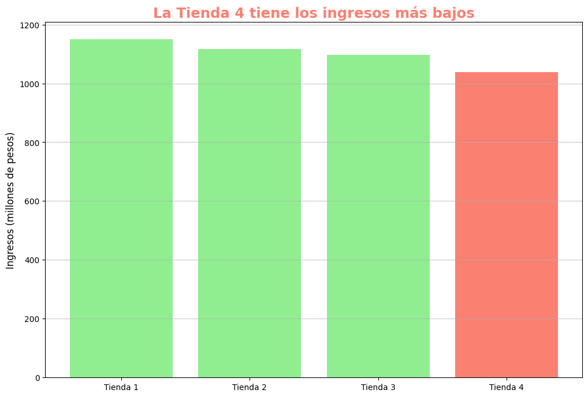
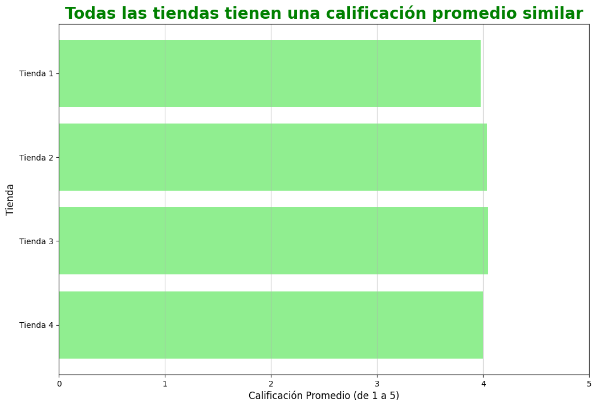
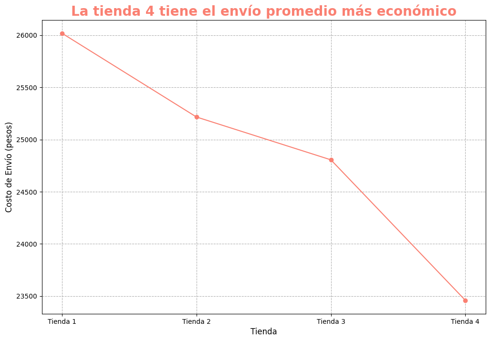

# Challenge: Alura Store

<p align="center">
  
  
  
  
</p>

---

### Tabla de Contenidos
1. [Descripción del Proyecto](#descripción-del-proyecto)
2. [Metodología y Análisis de Métricas](#metodología-y-análisis-de-métricas)
    * [1. Métrica Financiera: Ingresos Totales](#1-métrica-financiera-ingresos-totales)
    * [2. Métrica Logística: Costo de Envío Promedio](#2-métrica-logística-costo-de-envío-promedio)
    * [3. Métrica de Calidad Operacional: Calificación Promedio](#3-métrica-de-calidad-operacional-calificación-promedio)
    * [4. Desempeño Comercial: Categorías y Productos](#4-desempeño-comercial-categorías-y-productos)
3. [Visualización de Resultados](#visualización-de-resultados)
4. [Conclusión y Recomendación](#conclusión-y-recomendación)
5. [Estructura del Proyecto](#estructura-del-proyecto)
6. [Tecnologías y Dependencias](#tecnologías-y-dependencias)
7. [Cómo Ejecutar el Proyecto](#cómo-ejecutar-el-proyecto)

---

### Descripción del Proyecto

Este proyecto es parte del **Programa ONE - Oracle Next Education** en colaboración con Alura, desarrollado como un **Challenge de Data Science** para aplicar las habilidades de análisis de datos y visualización utilizando Python (Pandas y Matplotlib).

El objetivo principal es resolver un caso de negocio para el Sr. Juan, propietario de la cadena minorista **Alura Store Latam**, quien necesita vender una de sus cuatro sucursales para iniciar un nuevo emprendimiento. El desafío consiste en examinar el rendimiento de las cuatro tiendas (Tienda 1, Tienda 2, Tienda 3, Tienda 4) y **determinar cuál es la menos eficiente** para recomendar su venta basándose en métricas clave.

---

### Metodología y Análisis de Métricas

Se cargaron y combinaron los datos de las cuatro tiendas, procediendo al cálculo de métricas financieras, logísticas y comerciales.

#### 1. Métrica Financiera: Ingresos Totales
Se calculó la suma total de la columna `Precio` para cada tienda.

| Tienda | Ingresos Totales (Pesos) | Posición |
| :--- | :--- | :--- |
| **Tienda 1** | 1,150,880,400 | LÍDER |
| **Tienda 2** | 1,116,343,500 | 2do |
| **Tienda 3** | 1,098,019,600 | 3ro |
| **Tienda 4** | 1,038,375,700 | **ÚLTIMO** |

* **Hallazgo clave:** La **Tienda 4** presenta la debilidad financiera más marcada, con los ingresos totales más bajos de la cadena.

#### 2. Métrica Logística: Costo de Envío Promedio
Se calculó el promedio de la columna `Costo de envío`.

* **Hallazgo clave:** La **Tienda 4** tiene el costo de envío promedio más bajo ($23.459 Pesos), indicando la mayor eficiencia logística. Este dato contrasta con sus bajos ingresos.

#### 3. Métrica de Calidad Operacional: Calificación Promedio
Se calculó el promedio de la columna `Calificación`.

* **Hallazgo clave:** Todas las tiendas mantienen una calificación promedio alta y muy similar (entre 3.977 y 4.048). Esto sugiere que el problema de bajos ingresos en la Tienda 4 no está relacionado con la calidad del servicio o del producto.

#### 4. Desempeño Comercial: Categorías y Productos
Se analizaron las ventas por categoría (`Categoría del Producto`) y los productos más y menos vendidos.

* **Categorías principales:** Todas las tiendas dependen fuertemente de **Muebles** y **Electrónicos**.
* **Debilidad de la Tienda 4:** Es la que menos vende en categorías esenciales como **Electrodomésticos** (254 unidades) y en **Productos Especializados** (Instrumentos Musicales y Libros, con solo 170 unidades de Instrumentos Musicales).
* **Bajo volumen en productos clave:** La Tienda 4 reporta bajo desempeño en la venta de productos básicos como **Armario**, **Refrigerador** y **Lavadora de ropa**.

---

### Visualización de Resultados

A continuación, se presentan los gráficos generados con Matplotlib que sirvieron de base para las conclusiones del informe ejecutivo:

#### Ingresos Totales por Tienda
El gráfico de barras ilustra claramente la diferencia en los ingresos generados por cada sucursal, destacando a la Tienda 4 como la de menor rendimiento.


#### Calificación Promedio por Tienda
Este gráfico horizontal muestra la consistencia en la calidad del servicio al cliente en todas las tiendas, siendo una diferencia mínima entre ellas.


#### Costo de Envío Promedio por Tienda
El gráfico de línea revela que la Tienda 4, a pesar de tener los ingresos más bajos, es la más eficiente en costos logísticos, con el envío promedio más económico.


---

### Conclusión y Recomendación

La **Tienda 4** es la candidata recomendada para la venta.

| Justificación de la Venta | Detalle |
| :--- | :--- |
| **Baja Rentabilidad** | Última en ingresos totales. |
| **Ineficiencia Comercial** | A pesar de ser la más eficiente en logística (envío más barato) y tener un buen servicio al cliente, es **incapaz de transformar estas fortalezas en ventas** efectivas. |
| **Debilidades de Mercado** | Muestra el rendimiento más bajo en ventas de **Electrodomésticos** y **Productos Especializados**, demostrando una ineficiencia en cubrir varios segmentos del mercado. |

Vender la Tienda 4 permite al Sr. Juan retener las sucursales más fuertes (Tienda 1, 2 y 3).

---

### Estructura del Proyecto

El proyecto está compuesto por los siguientes archivos clave:

* **`AluraStoreLatam.ipynb`**: El *notebook* que contiene el código Python para la importación de datos, el análisis de métricas (Ingresos, Ventas por Categoría, Calificación, Costo de Envío) y la generación de los gráficos con Matplotlib.
* **`Informe Ejecutivo: Recomendación de Venta - Cadena Alura Store.pdf`**: Documento final que presenta la conclusión, la recomendación de venta y la justificación basada en los datos analizados.
* **`plots/`**: Carpeta que almacena los archivos de imagen de los gráficos generados (`.png`).
* **`README.md`**: Descripción y guía del proyecto.
* **`LICENSE`**: Información sobre la licencia del proyecto.

### Tecnologías y Dependencias

* **Python**
* **Pandas**: Utilizado para la manipulación, limpieza y análisis de los datos importados.
* **Matplotlib**: Utilizado para la creación de visualizaciones (gráficos de barras, horizontales y de línea).
* **Google Colab**: Entorno de desarrollo utilizado para ejecutar el *notebook*.

### Cómo Ejecutar el Proyecto
Este proyecto fue desarrollado en **Google Colab**, el entorno de ejecución recomendado, ya que incluye todas las dependencias necesarias preinstaladas.

1.  **Clonar el repositorio:**
    ```bash
    git clone https://github.com/iesvs-campi/oracle-one-challenge-alura-store.git
    cd oracle-one-challenge-alura-store
    ```

2.  **Abrir en Google Colab (Opción Recomendada):**
    * Sube el archivo `AluraStoreLatam.ipynb` a tu Google Drive.
    * Ábrelo con Google Colaboratory y ejecuta las celdas secuencialmente para replicar el análisis.

3.  **Ejecutar Localmente (Alternativa):**
    Si prefieres usar un entorno Jupyter local:
    * Asegúrate de tener Python instalado.
    * Instala las bibliotecas necesarias:
        ```bash
        pip install pandas matplotlib
        ```
    * Abre el *notebook* (`AluraStoreLatam.ipynb`) en tu entorno local y ejecútalo.
